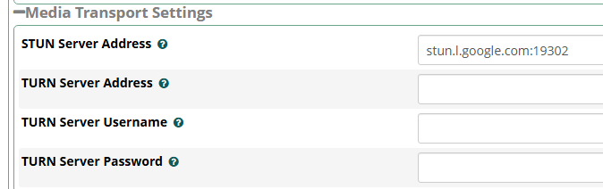

# 📱 Sangoma Connect (Soft Phone)

## Pré-réquis

Les modules suivants doivent être installé afin que Sangoma Connect puisse fonctionner.

* Sangoma Connect v15.0.43.13 or v16.0.30.12 (required)
* Sangomartapi v15.0.40  or v16.0.34 (required)
* Sysadmin v15.0.29.5 or v16.0.21 (required)
* Restapps v15.0.30 or v16.0.25 (required)
* Firewall v15.0.39 or v16.0.57.1 (not required, recommended minimum version if Firewall module is being used)
* Framework v15.0.23.11 or v16.0.21.3 (required)
* Asterisk 13 et +

## Licence

Pour opéré, vous devez avoir achetés des licences "Softphones" au préalable. Vous pouvez consulter le nombre de licence active en visitant: Admin --> SagomaConnect

Lors de l'installation ou la mise à jour du module sagomartapi, il faudra également mettre à jour les modules suivants:

* contactmanager
* restapps
* sangomaconnect
* sysadmin
* userman
* webrtc &#x20;


Remarque : lors de l'installation du module sangomartapi à partir de la ligne de commande, vous devrez peut-être utiliser la commande "downloadinstall" si une version précédente n'existe pas déjà sur votre système. Dans ce cas, vous pourriez voir une erreur "Impossible de trouver le module" lors de l'utilisation de la commande "installer". Si vous avez une installation existante du module, la commande "update" devrait fonctionner.


```shell
fwconsole ma downloadinstall sangomartapi
```

En tapant la commande:

```shell
asterisk -rx "manager show commands"|grep PJSIP
```

Vous devriez obtenir le résultat suivant:

```sh
# asterisk -rx "manager show commands"|grep PJSIP
 
  PJSIPCallIDToChannel
  PJSIPNotify                                  Send a NOTIFY to either an endpoi
  PJSIPQualify                                 Qualify a chan_pjsip endpoint.
  PJSIPRegister                                Register an outbound registration
  PJSIPShowAors                                Lists PJSIP AORs.
  PJSIPShowAuths                               Lists PJSIP Auths.
  PJSIPShowContacts                            Lists PJSIP Contacts.
  PJSIPShowEndpoint                            Detail listing of an endpoint and
  PJSIPShowEndpoints                           Lists PJSIP endpoints.
  PJSIPShowRegistrationInboundContactStatuses  Lists ContactStatuses for PJSIP i
  PJSIPShowRegistrationsInbound                Lists PJSIP inbound registrations
  PJSIPShowRegistrationsOutbound               Lists PJSIP outbound registrationshe
  PJSIPShowResourceLists                       Displays settings for configured
  PJSIPShowSubscriptionsInbound                Lists subscriptions.
  PJSIPShowSubscriptionsOutbound               Lists subscriptions.
  PJSIPUnregister                              Unregister an outbound registration
```

Si PJSIPCallIDToChannel n'est pas répertorié. Installez manuellement le rpm. Asterisk devra être rechargé après l'installation. Voir la documentation [ici](https://wiki.freepbx.org/display/CONNECT/How+to+Setup+Sangoma+Phone+Desktop+on+the+PBX)

## Ports

Les utilisateurs devront pouvoir accéder à ces ports système, ce qui peut nécessiter une redirection de port pour les utilisateurs distants.

### Sangoma Phone Desktop Client Service

Ce numéro de port devra être donné aux utilisateurs, car ils devront l'inclure avec l'adresse de l'hôte lors de la connexion. Il peut être configuré via le menu Admin --> System Admin --> Port Mangement

<figure><figcaption><p>Il s'agit du port 6443 par défaut</p></figcaption></figure>

### UCP

Ceci est nécessaire pour utiliser l'option Mot de passe oublié à partir de l'écran de connexion. La page de connexion UCP sera chargée dans un navigateur Web, qui dispose d'un outil Mot de passe oublié. Les mêmes informations d'identification sont utilisées pour UCP et le client Sangoma Connect Desktop.

### 6000-6199

Ces ports non pas besoin d'être autorisé à l'externe puisqu'il ne sont qu'utilisé à l'interne.

## Firewall

Pour certains environnements où Sangoma Phone sera utilisé à partir de réseaux distants, les paramètres d'accessibilité de la zone doivent être correctement définis pour le port du service client Sangoma Phone Desktop.

Ces paramètres ce retouve dans Connectivity-->Firewall-->Services-->Extra Services

<figure><figcaption><p>Par défaut, le service est ouvert uniquement à la zone locale, activez-le pour les autres zones uniquement si nécessaire</p></figcaption></figure>

## Asterisk SIP Settings

Sélectionner le certificat SSL dans Settings-->Asterisk SIP Settings-->SIP Settings\[chan\_pjsip].

<figure><figcaption></figcaption></figure>

Assurez-vous que TLS et WS soit activé dans Settings-->Asterisk SIP Settings-->SIP Settings\[chan\_pjsip].

<figure><figcaption></figcaption></figure>

Changer le port 5061 --> 5060 dans (tls)

<figure><figcaption></figcaption></figure>

Une fois activé, modifier le "Default TLS Port Assignment" à PjSip dans l'onglet "General SIP Settings".

<figure><figcaption></figcaption></figure>

### STUN Server

<figure><figcaption></figcaption></figure>

### ICE Host Candidates

<figure><figcaption></figcaption></figure>

## Advanced Settings <a href="#howtosetupsangomaphonedesktoponthepbx-advancedsettings" id="howtosetupsangomaphonedesktoponthepbx-advancedsettings"></a>

Activé le mini-HTTP server avec TLS et forcé le WebSocket Mode to PJSIP. (Settings-->Advanced Settings)

<figure><figcaption></figcaption></figure>


La fonction "Force WebSocket Mode" ne pourrait ne pas être présente.


Définissez l'application Conference Room App sur app\_confbridge. Les fonctionnalités de conférence de Sangoma Phone ne fonctionneront que si l'ensemble d'applications Conference Room App est configuré sur ConfBridge (app\_confbridge).

<figure><figcaption></figcaption></figure>

## SangomaConnect Settings <a href="#howtosetupsangomaphonedesktoponthepbx-sangomaconnectsettings" id="howtosetupsangomaphonedesktoponthepbx-sangomaconnectsettings"></a>

Définissez l'adresse hôte du PBX dans Admin-->SangomaConnect-->Settings.

<figure><figcaption></figcaption></figure>

Pour éviter les problèmes potentiels, il est conseillé de :&#x20;

* D'avoir un domaine complet est recommandé (FQDN)
* D'avoir un port sécurisé pour "Sangoma Phone Desktop Client Service" dans Admin-->System Admin-->Port Management

## Configuration Utilisateur

### SangomaConnect Settings

Chaque utilisateur de Sangoma Phone devra être basé sur une extension PJSip existante.

Dans le Gestionnaire des utilisateurs, les utilisateurs de Sangoma Phone devront avoir l'option "**Enable Sangoma Phone Login**" activée dans l'onglet SangomaConnect de leurs paramètres utilisateur.

<figure><figcaption></figcaption></figure>

### Language Settings

L'écran de connexion du client de bureau sera toujours en anglais. Une fois connecté avec succès, le client sera traduit si le paramètre de langue de l'utilisateur correspond à une langue prise en charge par le client. Sinon, il sera par défaut en anglais. Le paramètre de langue de l'utilisateur peut être défini via Admin-->User Management, en modifiant un utilisateur ou un groupe.

<figure><figcaption></figcaption></figure>
