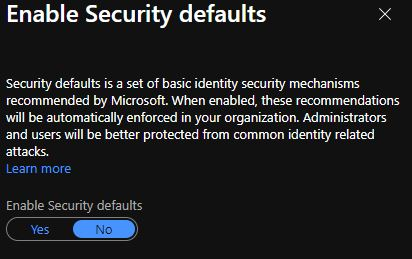

# 🔑 2FA

Par défaut, Azure demande à ce que tout les utilisateurs utilise l'authentification à deux facteurs. Pour désactiver cette fonction, vous devez vous connecter à votre organisation à l'aide d'un compte administrateur.

Une fois dans le panneau d'administration, cliquez sur _Azure Active Directory_&#x20;

Cliquez de nouveau sur _Azure Active Directory_&#x20;

Ensuite sur _Properties_

Et sur "Manage Security defaults" dans la section de droite, complètement vers le bas&#x20;

Vous devez sélectionner _No_

