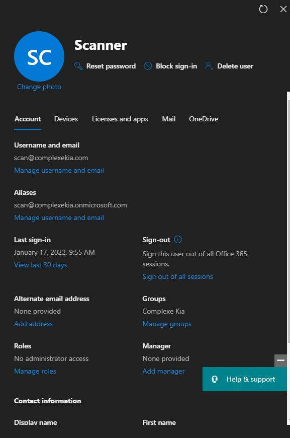
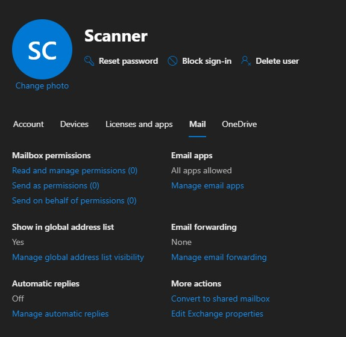
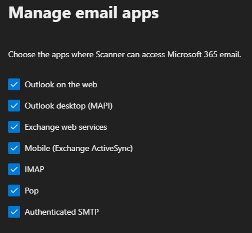

# SMTP AUTH (Scan)

## Configuration de base

Afin de pouvoir utilisé une adresse office365 pour l'envois de courriel, vous devez d'abord activé la fonction SMTP AUTH pour cette adresse.

Sélectionnez ensuite "Mail"

Sélectionnez "Manage email apps" et cochez "Authenticated SMTP"

### Konica Minolta

Voici un exemple de configuration pour une imprimante de marque Konica Minolta

 (1).png>)

### Lexmark

Voici un exemple de configuration pour une imprimante de marque Lexmark

 (1).png>)

### Toshiba

Voici un exemple de configuration pour une imprimante de marque Toshiba.

