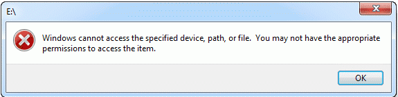
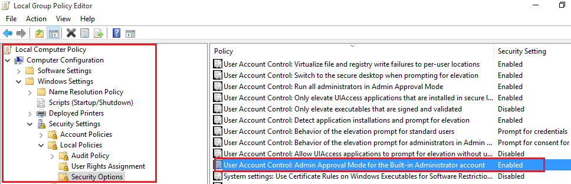

# ❓ Résolution de problèmes

## Partage Windows

### Erreur connexion multiple

Lors d'une tentative de connexion à un partage Windows l'erreur suivante peux survenir (Poste client):

> _Multiple connections to a server or shared resource by the same user, using more than one user name, are not allowed. Disconnect all previous connections to the server or shared resource and try again._

Ces lignes de commandes peuvent résoudre le problème:

```bash
net stop workstation /y
net start workstation
```


Vous devez exécuter ces commandes en tant qu'administrateur


## Windows cannot access the specified device, path, or file.

Une erreur peux survenir lorsque, par exemple, vous souhaitez éditez les options d'adaptateurs réseau via le nouveau panneau de configuration.



Pour corriger cette erreur, voici les étapes:

1. Ouvrez gpedit.msc
2. Rendez-vous dans le chemin suivant
   1. Computer Configuration
   2. Windows Settings
   3. Security Settings
   4. Local Policies
   5. Security Options
3. Il faut ensuite activez la fonction "_User Account Control: Admin Approval Mode for the Built-in Administrator account"_
4. Redémarrer ensuite le serveur
5. Problème réglé !



## Firewall

Dans le processus de filtrage du trafic Internet, tous les pare-feu ont un certain type de fonction de journalisation qui documente la façon dont le pare-feu a traité divers types de trafic. Ces journaux peuvent fournir des informations précieuses telles que les adresses IP source et de destination, les numéros de port et les protocoles. Vous pouvez également utiliser le fichier journal du pare-feu Windows pour surveiller les connexions TCP et UDP et les paquets bloqués par le pare-feu.

### Générer le ficher Log

Par défaut, le fichier journal est désactivé, ce qui signifie qu'aucune information n'est écrite dans le fichier journal. Pour créer un fichier journal, appuyez sur « Touche Win + R » pour ouvrir la boîte de dialogue Exécuter. Tapez "wf.msc" et appuyez sur Entrée. L'écran «Windows Firewall with Advanced Security » apparaît. Sur le côté droit de l'écran, cliquez sur « Properties ».


Une nouvelle boîte de dialogue apparaît. Cliquez maintenant sur l'onglet « Domain Profil » et sélectionnez « Customize » dans la « Logging Section ».


Si votre serveur n'est pas un contrôleur de domaine, sélectionner « Private Profil »



Une nouvelle fenêtre s'ouvre et à partir de cet écran, choisissez votre taille de journal maximale, votre emplacement et si vous souhaitez enregistrer uniquement les paquets abandonnés, la connexion réussie ou les deux. Un paquet abandonné est un paquet que le pare-feu Windows a bloqué. Une connexion réussie fait référence à la fois aux connexions entrantes et à toute connexion que vous avez établie sur Internet, mais cela ne signifie pas toujours qu'un intrus s'est connecté avec succès à votre ordinateur.


Par défaut, le pare-feu Windows écrit des entrées de journal dans`%SystemRoot%\System32\LogFiles\Firewall\Pfirewall.log` et stocke uniquement les 4 derniers Mo de données. Dans la plupart des environnements de production, ce journal écrira constamment sur votre disque dur, et si vous modifiez la limite de taille du fichier journal (pour enregistrer l'activité sur une longue période), cela peut avoir un impact sur les performances. Pour cette raison, vous devez activer la journalisation uniquement lors du dépannage actif d'un problème, puis désactiver immédiatement la journalisation lorsque vous avez terminé.

Sur l'écran principal "Windows Firewall with Advanced Security", faites défiler jusqu'à ce que vous voyiez le lien "Monitoring". Dans le volet Détails, sous "Logging Settings", cliquez sur le chemin du fichier à côté de "File Name". Le journal s'ouvre dans le Bloc-notes.


### Interpréter le fichier Log


Voici une liste descriptive de chaque champs


Le journal de sécurité du pare-feu Windows contient deux sections. L'en-tête fournit des informations statiques et descriptives sur la version du journal et les champs disponibles. Le corps du journal est constitué des données compilées saisies à la suite du trafic qui tente de traverser le pare-feu. Il s'agit d'une liste dynamique et de nouvelles entrées continuent d'apparaître au bas du journal. Les champs sont écrits de gauche à droite sur la page. Le (-) est utilisé lorsqu'il n'y a pas d'entrée disponible pour le champ.


* date — The date field identifies the date in the format YYYY-MM-DD.&#x20;
* time — The local time is displayed in the log file using the format HH:MM:SS. The hours are referenced in 24-hour format.&#x20;
* action — As the firewall processes traffic, certain actions are recorded. The logged actions are DROP for dropping a connection, OPEN for opening a connection, CLOSE for closing a connection, OPEN-INBOUND for an inbound session opened to the local computer, and INFO-EVENTS-LOST for events processed by the Windows Firewall, but were not recorded in the security log.&#x20;
* protocol — The protocol used such as TCP, UDP, or ICMP.&#x20;
* src-ip — Displays the source IP address (the IP address of the computer attempting to establish communication).&#x20;
* dst-ip — Displays the destination IP address of a connection attempt.&#x20;
* src-port — The port number on the sending computer from which the connection was attempted.&#x20;
* dst-port — The port to which the sending computer was trying to make a connection.&#x20;
* size — Displays the packet size in bytes.
* tcpflags — Information about TCP control flags in TCP headers.&#x20;
* tcpsyn — Displays the TCP sequence number in the packet.
* tcpack — Displays the TCP acknowledgement number in the packet.&#x20;
* tcpwin — Displays the TCP window size, in bytes, in the packet.&#x20;
* icmptype — Information about the ICMP messages.&#x20;
* icmpcode — Information about the ICMP messages.&#x20;
* info — Displays an entry that depends on the type of action that occurred.&#x20;
* path — Displays the direction of the communication. The options available are SEND, RECEIVE, FORWARD, and UNKNOWN.

## Problème Synchronisation Temps

Si vous n'arrivez pas à avoir la bonne heure malgré que le bon fuseau horaire soit sélectionné, utiliser la commande suivante pour forcer un serveur NTP spécifique:


Les commandes doivent être exécuté en tant qu'administrateur.


```sh
w32tm /config /update /manualpeerlist:0.ca.pool.ntp.org,0x8 /syncfromflags:MANUAL
```

S'il est nécessaire de forcer une mise à jour sur un poste client, utiliser la commande suivante:

```sh
w32tm /resync
```
