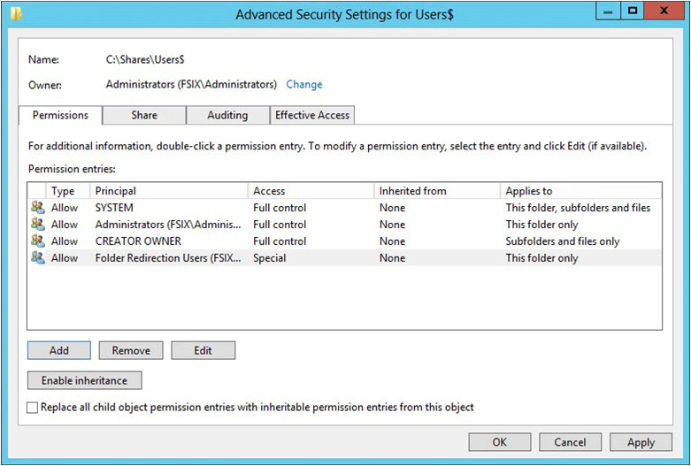

# GPO

## Folder Redirection

Voici la procédure afin d'activer la fonction _Folder Redirection_

### Prérequis

* Vous devez vous assurez d'être connecté avec un compte Administrateur
* Avoir le rôle "File Server" installé
* Les clients doivent avoir Windows 7 et +

### Groupe de sécurité

Il vous fera un groupe de sécurité auquel vous attribuerez la fonction de Folder Redirection. Vous pouvez soit créer un groupe spécifique à cette fonction ou simplement utiliser vos groupes déjà en place. Exemple: Les groupes Administrations et Comptabilité

### Création du partage

1. Ouvrez le Server Manager
2. Sélectionnez `File and Storage Services --> Shares`
3. Cliquez droit sur la fenêtre et sélectionnez `New Share`
4. Sélectionnez `SMB Share – Quick`
5. Sélectionnez l'endroit ou vous souhaitez créer votre partage dans l'espace `Share Location`
6. Donnez un nom au partage dans la section `Share Name`
7. Sur la page Autres paramètres, décochez la case `Enable continuous availability`, le cas échéant. En option, cochez les cases `Enable access-based enumeration` et `Encrypt data access`.
8. Sur la page des permissions, sélectionnez `Customize permissions`
9. Sélectionnez `Disable inheritance` et sélectionnez `Convert inherited permissions into explicit permission on this object.`
10. Définissez les permissions suivantes pour les groupes concernés


Assurez vous d'afficher les options avancés afin de voir l'ensemble des permissions


|              User Account             |                                                                       Permission                                                                       |             Applies To            |
| :-----------------------------------: | :----------------------------------------------------------------------------------------------------------------------------------------------------: | :-------------------------------: |
|                 System                |                                                                      Full Control                                                                      | This folder, subfolders and files |
|             Administrators            |                                                                      Full Control                                                                      |          This folder only         |
|             Creator/Owner             |                                                                      Full Control                                                                      |     Subfolders and files only     |
| Security Group for Folder Redirection | <p>List folder/read data </p><p>Create folders/append data Read attributes</p><p> Read extended attributes Read</p><p>Traverse folder/execute file</p> |          This folder only         |
|       Other groups and accounts       |                                                None (Remove any accounts that this table does not list)                                                |                 -                 |




Assurez vous que les utilisateurs sont correctement ajoutés à leur(s) groupe(s)


### Création de la GPO

Voici les étapes afin de créer la GPO Folder Redirection

1. Ouvrez le `Group Policy Management`
2. Dans la gestion des stratégies de groupe, cliquez avec le bouton droit sur le domaine ou l'unité d'organisation dans lequel vous souhaitez configurer la redirection de dossiers, puis sélectionnez `Create a GPO in this domain, and Link it here`
3. Définissez le nom de la GPO
4. Sélectionnez la GPO. Selectionnez `Scope -> Security Filtering > Authenticated Users`, and then select Remove to prevent the GPO from being applied to everyone.Select the GPO. Select Scope > Security Filtering > Authenticated Users, and then select Remove to prevent the GPO from being applied to everyone.
5. Dans la section `Security Filtering` sélectionnez `Add`
6. Dans la section `Select User, Computer, or Group` sélectionnez les groupes qui seront affectés par le Folder Redirection.
7. Sélectionnez `Delegation -> Add`, puis saisissez `Authenticated Users`. Sélectionnez OK, puis sélectionnez à nouveau OK pour accepter l'autorisation de lecture par défaut.


Assurez vous de lié votre GPO au bon niveau de l'unité organisationnel


### Configuration de la GPO

Après avoir créer la GPO, il nous faut maintenant la configurer. Voici les étapes à suivre:

1. Cliquez droit sur la GPO et cliquez sur `Edit`
2. In the Group Policy Management Editor window, navigate to `User Configuration -> Policies -> Windows Settings -> Folder Redirection`.
3. Cliquez avec le bouton droit sur un dossier que vous souhaitez rediriger (par exemple, Documents), puis sélectionnez `Properties`.
4. Dans la fenêtre `Properties`, dans la zone `Settings`, selectionnez `Basic - Redirect everyone’s folder to the same location`.
5. Dans la section Emplacement du dossier cible, sélectionnez Créer un dossier pour chaque utilisateur sous le chemin racine, puis dans la zone Chemin racine, entrez le chemin d'accès au partage de fichiers qui stocke les dossiers redirigés, par exemple : `\fs1.corp.contoso. com\users$`.
6. (Facultatif) Sélectionnez l'onglet Paramètres, et dans la section Suppression de la stratégie, sélectionnez `Redirect the folder back to the local userprofile location when the policy is removed` (ce paramètre peut aider à rendre la redirection de dossier plus prévisible pour les administrateurs et les utilisateurs).
7. Sélectionnez OK, puis sélectionnez Oui dans la boîte de dialogue Avertissement.

#### Paramètres supplémentaires

Les options suivantes permettent de définir le comportement du Folder Redirection en cas de perte de connexion avec le serveur.

1. Rendez-vous dans `User Configuration -> Policies -> Administrative Templates -> Network -> Offline Files`.
2. Voici les options pertinentes:

|                      Setting                     |                                                                                                                                                                       Description                                                                                                                                                                       |        Action        |
| :----------------------------------------------: | :-----------------------------------------------------------------------------------------------------------------------------------------------------------------------------------------------------------------------------------------------------------------------------------------------------------------------------------------------------: | :------------------: |
|            Action on server disconnect           | <p>If you enable this setting, you can use the "Action" box to specify how computers in the group respond.</p><p>-- "Work offline" indicates that the computer can use local copies of network files while the server is inaccessible.</p><p>-- "Never go offline" indicates that network files are not available while the server is inaccessible.</p> | Action: Work Offline |
| Synchronize all offline files before logging off |                                                                                                       If you enable this setting, offline files are fully synchronized. Full synchronization ensures that offline files are complete and current.                                                                                                       |        Enabled       |
| Synchronize all offline files before logging off |                                                    If you enable this setting, offline files are fully synchronized at logon. Full synchronization ensures that offline files are complete and current. Enabling this setting automatically enables logon synchronization in Synchronization Manager.                                                   |        Enabled       |

### Test de Folder Redirection

Voici comment tester le Folder Redirection:

1. Connectez-vous à un ordinateur en utilisant un compte d'utilisateur pour lequel vous avez activé la redirection de dossiers.
2. Si l'utilisateur s'est déjà connecté à l'ordinateur, ouvrez une invite de commandes avec élévation de privilèges, puis tapez la commande suivante pour vous assurer que les derniers paramètres de stratégie de groupe sont appliqués à l'ordinateur client:

```bash
gpupdate /force
```

1. Ouvrez le File Explorer
2. Cliquez droit sur un dossier redirigé comme par exemple Documents et sélectionnez `Properties`.
3. Sélectionnez l'onglet `Location` et confirmez que le chemin affiche le partage de fichiers que vous avez spécifié au lieu d'un chemin local.

La configuration du Folder Redirection est maintenant complété !

### CheckList

* [ ] Prepare domain and other prerequisites
  * [ ] Join computers to domain
  * [ ] Create user accounts
  * [ ] Check file server prerequisites and compatibility with other services
  * [ ] Does the file server also host Remote Desktop Services?
  * [ ] Restrict access to the file server Step 1: Create a folder redirection security group
* [ ] **Step 1: Create a folder redirection security group**
  * [ ] Group name:
  * [ ] Members:&#x20;
* [ ] **Step 2: Create a file share for redirected folders**
  * [ ] File share name:&#x20;
* [ ] **Services Step 3: Create a GPO for Folder Redirection**
  * [ ] GPO name:&#x20;
* [ ] **Step 5: Configure the Group Policy settings for Folder Redirection and Offline Files**
  * [ ] Redirected folders:
  * [ ] Windows 2000, Windows XP, and Windows Server 2003 support enabled?
  * [ ] Offline Files enabled? (enabled by default on Windows client computers)
  * [ ] Always Offline Mode enabled?
  * [ ] Background file synchronization enabled?
  * [ ] Optimized Move of redirected folders enabled? (Optional) Enable primary computer support:
  * [ ] Computer-based or User-based?
  * [ ] Designate primary computers for users
  * [ ] Location of user and primary computer mappings:
  * [ ] (Optional) Enable primary computer support for Folder Redirection
  * [ ] (Optional) Enable primary computer support for Roaming User Profiles&#x20;
  * [ ] **Step 6: Enable the Folder Redirection GPO**&#x20;
  * [ ] **Step 7: Test Folder Redirection**

## Google Chrome

Voici comment contrôler Google Chrome à l'aide de GPO.

> For Windows, there are two types of policy templates: an ADM and an ADMX template. Verify which type you can use on your network. The templates show which registry keys you can set to configure Chrome, and what the acceptable values are. Chrome looks at the values set in these registry keys to determine how to act.
>
> **Step1: Download Chrome policy templates**
>
> 1. [Download Google Chrome Bundle](https://enterprise.google.com/chrome/chrome-browser/#download).
> 2. Open the bundle.
>
> Find the policy templates in the Configuration folder and the documentation in the Documentation folder.
>
> You can also download the templates separately and view common policy documentation for all operating systems here: [Zip file of Google Chrome templates and documentation](https://dl.google.com/dl/edgedl/chrome/policy/policy\_templates.zip).
>
> **Step 2: Open the ADM or ADMX template you downloaded**
>
> 1. Navigate to **Start > Run: gpedit.msc**. (Or run **gpedit.msc** in your terminal)
> 2. Navigate to **Local Computer Policy > Computer Configuration > Administrative Templates**.
> 3. Right-click **Administrative Templates**, and select **Add/Remove Templates**.
> 4. Add the **chrome.adm** template via the dialog.
> 5. Once complete, a Google / Google Chrome folder will appear under Administrative Templates if it's not already there. If you added the ADM template on Windows 7 or 10, it will appear under Classic Administrative Templates / Google / Google Chrome.
>
> Source: [https://support.google.com/chrome/a/answer/187202?hl=en#zippy=%2Cwindows](https://support.google.com/chrome/a/answer/187202?hl=en#zippy=%2Cwindows)

### uBlock Origin

Il est possible de configurer la "White List" de uBlock Origin via une GPO. Pour ce faire, il nous faut créer un nouvel enregistrement dans le RegEdit.

Tout d'abord la GPO doit être placé dans l'endroit suivant en mode "Update":

```
Computer Configuration\Preferences\Windows Settings\Registry
```

Dans l'onglet "Properties", ajoutez les informations suivantes:


Un "\n" doit précéder chaque site que vous souhaitez ajouter


```
Hive: HKEY_LOCAL_MACHINE

Key Path: Software\Policies\Google\Chrome\3rdparty\extensions\cjpalhdlnbpafiamejdnhcphjbkeiagm\policy

Value name:adminSettings

Value type: REG_SZ

Value data: {"autoUpdate":true,"netWhitelist":"about-scheme\nbehind-the-scene\nchrome-extension-scheme\nchrome-scheme\nlocalhost\nloopconversation.about-scheme\nopera-scheme\nWHITELISTWEBSITE.com"}
```

Une fois complété, il faut mettre à jour les policies (gpupdate /force) et dans certain cas, redémarrer le poste.
